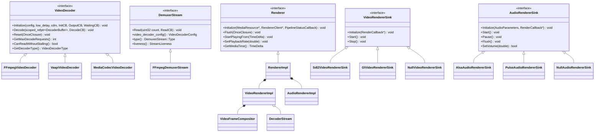

# 03 · 核心类与接口设计

> 上一篇：[02 总体架构与模块划分](02-总体架构与模块划分.md) ｜ 下一篇：[04 线程模型与数据流](04-线程模型与数据流.md)

> **实现状态**：本篇是设计文档，描述目标形态。**当前已落地到哪一步以
> [PROGRESS.md](PROGRESS.md) 为唯一真相源**；两者的差异（已实现 / 计划中）在 PROGRESS.md 里逐项标注。

本篇给出**头文件级**声明。命名、签名、注释风格全面对齐 Google C++ Style + Chromium `media/`。
所有代码块是设计稿（未编译），但可直接作为实现依据。

注释约定（Chromium 风格）：
- `// Thread-safe.` — 任意线程可调
- `// Called on |task_runner|.` — 绑定某 sequence
- `// |param|` — 参数用竖线包裹
- `GUARDED_BY(lock_)` / `GUARDED_BY_CONTEXT(sequence_checker_)` — clang thread-safety 注解

---

## 1. 类图

### 1.1 组件关系（ASCII）

```
                        player::Player  (SDK, thread-safe, Pimpl)
                              │
                              ▼
                    player::PipelineControllerHost
                              │  owns
                              ▼
                     media::PipelineController ──► media::Pipeline
                              │                        │
                              │              ┌─────────┴──────────┐
                              │              ▼                    ▼
                              │      media::RendererImpl    media::MediaLog
                              │              │
                              │   ┌──────────┼──────────┬──────────────┐
                              │   ▼          ▼          ▼              ▼
                              │ Video      Audio      Text        AvSync
                              │ Renderer   Renderer   Renderer    Controller
                              │ Impl       Impl                     │
                              │   │          │                      ▼
                              │   │          │              media::TimeSource
                              │   ▼          ▼                (audio/video/ext)
                              │ VideoFrame  AudioRenderer
                              │ Compositor  Algorithm(WSOLA)
                              │   │          │
                              │   │          ▼
                              ▼   ▼   AudioRendererSink::RenderCallback
                        media::VideoRendererSink      ::Render(delay, ts,
                              │                          glitch, AudioBus*)
                              ▼                                ▼
                    platform::{sdl2,linux,null}         media::AudioOutputDevice
                      VideoRendererSink                       │
                              │                                ▼
                              ▼                     platform::{sdl2,linux,null}
                    X11 / Wayland 窗口                 AudioRendererSink → 声卡

     media::FFmpegDemuxer (own thread "avbase-demux")
            │  DemuxerStream::Read(count, ReadCB)
            ▼
     media::DecoderStream<VideoDecoder, VideoFrame>   ← 选择 + 回退 + 异步泵
            │  VideoDecoder::Decode(scoped_refptr<DecoderBuffer>, DecodeCB)
            ▼
     platform::ffmpeg::FFmpegVideoDecoder  /  MediaCodecVideoDecoder ...
```

### 1.2 继承体系（Mermaid）



---

## 2. `base/` 关键类型（用法示例，不重复 Chromium 文档）

```cpp
// base/types/expected.h —— API 镜像 Chromium base/types/expected.h
namespace avbase::base {
template <typename T, typename E> class expected;
template <typename E> class unexpected;
template <typename T> class ok;
}  // namespace avbase::base

// base/expected_macros.h
#define RETURN_IF_ERROR(expr) ...
#define ASSIGN_OR_RETURN(lhs, rexpr) ...

// base/time/time.h
namespace avbase::base {
class TimeDelta;    // InSeconds/InMilliseconds/InMicroseconds/InSecondsF, is_zero, is_infinte
class TimeTicks;    // 单调时钟时间点（= 我 v1 的 Timestamp 的墙上域）
class Time;         // 墙上时钟（Unix epoch）
class TickClock;    // 可注入：NowTicks()
}  // namespace avbase::base

// ★媒体时间戳统一用 base::TimeDelta（Chromium 约定），不再自定义 Timestamp 类型
//   media time 0 == 媒体起点；base::TimeDelta() 表示零点，kNoTimestamp 用单独常量表达

// base/functional/callback.h
namespace avbase::base {
template <typename Sig> class OnceCallback;
template <typename Sig> class RepeatingCallback;
using OnceClosure = OnceCallback<void()>;
using RepeatingClosure = RepeatingCallback<void()>;
}  // namespace avbase::base

// base/functional/bind.h
base::OnceClosure cb = base::BindOnce(&Foo::Bar, weak_factory_.GetWeakPtr(), 42);
base::RepeatingCallback<void(int)> r = base::BindRepeating([](int x) { ... });

// base/memory/scoped_refptr.h + ref_counted.h
class VideoFrame : public base::RefCountedThreadSafe<VideoFrame> { ... };
scoped_refptr<VideoFrame> frame = base::MakeRefCounted<VideoFrame>(...);

// base/memory/weak_ptr.h
class Foo {
  base::WeakPtr<Foo> GetWeakPtr() { return weak_factory_.GetWeakPtr(); }
 private:
  base::WeakPtrFactory<Foo> weak_factory_{this};   // ★必须是最后一个成员
};

// base/task/sequenced_task_runner.h
scoped_refptr<base::SequencedTaskRunner> runner =
    base::SequencedTaskRunner::GetCurrentDefault();
runner->PostTask(FROM_HERE, base::BindOnce(&Foo::Bar, weak_ptr));
runner->PostDelayedTask(FROM_HERE, base::BindOnce(...), base::Milliseconds(10));
base::PostTaskAndReplyWithResult(runner.get(), FROM_HERE,
                                 base::BindOnce(&Compute),
                                 base::BindOnce(&OnComputed, weak_ptr));
```

> **v1 → v2 的命名变化**：v1 的 `avbase::Timestamp` / `Duration` 全部改为 **`base::TimeDelta`**（媒体时间）与 **`base::TimeTicks`**（墙上时间），与 Chromium 完全一致。`NOPTS` 用 `media::kNoTimestamp`（一个 `base::TimeDelta` 哨兵常量，值为 `base::TimeDelta::Min()`）表达，并在所有比较/算术处显式检查。

---

## 3. `media/base/` — 核心值类型

### 3.1 `DecoderBuffer`（= ijkplayer 的 AVPacket 封装）

```cpp
// media/base/decoder_buffer.h
#ifndef AVBASE_MEDIA_BASE_DECODER_BUFFER_H_
#define AVBASE_MEDIA_BASE_DECODER_BUFFER_H_

#include <stdint.h>

#include <memory>
#include <span>
#include <vector>

#include "base/memory/ref_counted.h"
#include "base/memory/scoped_refptr.h"
#include "base/time/time.h"
#include "media/base/media_export.h"
#include "media/base/media_types.h"

namespace avbase {
namespace media {

// A container for a compressed media sample, analogous to Chromium's
// `media::DecoderBuffer` and wrapping what ijkplayer passes around as a raw
// `AVPacket`.
//
// Instances are immutable after construction and always held through
// `scoped_refptr<DecoderBuffer>`. Copying is ref-count bumping, O(1).
//
// The actual byte storage is type-erased via `BufferStorage` so that no
// FFmpeg type appears in this header. FFmpeg adapters downcast with
// `storage_as<T>()` (no RTTI; identity is a static address).
class MEDIA_EXPORT DecoderBuffer
    : public base::RefCountedThreadSafe<DecoderBuffer> {
 public:
  // Opaque storage backend. Implemented by platform/ffmpeg (AvPacketStorage),
  // by media/filters (own-memory), and by embedders (encrypted / custom).
  class Storage {
   public:
    virtual ~Storage() = default;
    virtual const void* TypeId() const = 0;
    virtual size_t size() const = 0;
    virtual std::span<const uint8_t> data() const = 0;   // 空表示不可 CPU 读
   };

  DecoderBuffer(const DecoderBuffer&) = delete;
  DecoderBuffer& operator=(const DecoderBuffer&) = delete;

  // Creates a buffer owning a copy of |data|.
  static scoped_refptr<DecoderBuffer> CopyFrom(const uint8_t* data,
                                               size_t size,
                                               const uint8_t* side_data,
                                               size_t side_data_size);
  // Creates a buffer that adopts |storage| without copying.
  static scoped_refptr<DecoderBuffer> FromStorage(std::unique_ptr<Storage> storage);
  // Creates an end-of-stream marker.
  static scoped_refptr<DecoderBuffer> CreateEOSBuffer();

  bool IsEndOfStream() const { return is_eos_; }

  base::TimeDelta timestamp() const { return timestamp_; }     // == AVPacket::pts
  base::TimeDelta decode_timestamp() const { return decode_timestamp_; }  // == dts
  base::TimeDelta duration() const { return duration_; }
  // Best-effort timestamp: |timestamp()| if valid, else |decode_timestamp()|.
  base::TimeDelta BestEffortTimestamp() const;
  bool has_valid_timestamp() const;

  size_t data_size() const;
  std::span<const uint8_t> data() const;
  std::span<const uint8_t> side_data() const;
  int64_t offset_in_container() const { return offset_; }
  DemuxerStream::Type stream_type() const { return stream_type_; }
  int32_t stream_index() const { return stream_index_; }
  // Seek generation; bumped by DemuxerStream::Flush(). Buffers with a stale
  // serial must be dropped. See docs/04 §4.
  int32_t serial() const { return serial_; }
  bool is_keyframe() const { return is_keyframe_; }
  bool IsDiscardable() const { return discardable_; }
  void set_discardable(bool v) { discardable_ = v; }

  // Adapter escape hatch. Returns nullptr if the storage is not of type |T|.
  // Only platform/ffmpeg and media/filters/ffmpeg_* may call this.
  template <typename T>
  T* storage_as() {
    return storage_ && storage_->TypeId() == T::TypeIdStatic()
               ? static_cast<T*>(storage_.get()) : nullptr;
  }
  template <typename T>
  const T* storage_as() const;

  Storage* storage() { return storage_.get(); }

 private:
  friend class base::RefCountedThreadSafe<DecoderBuffer>;
  ~DecoderBuffer() override;

  DecoderBuffer();
  explicit DecoderBuffer(std::unique_ptr<Storage> storage);

  std::unique_ptr<Storage> storage_;
  base::TimeDelta timestamp_;
  base::TimeDelta decode_timestamp_;
  base::TimeDelta duration_;
  int64_t offset_{-1};
  DemuxerStream::Type stream_type_{DemuxerStream::UNKNOWN};
  int32_t stream_index_{-1};
  int32_t serial_{0};
  bool is_eos_{false};
  bool is_keyframe_{false};
  bool discardable_{false};
};

// Sentinel for "no timestamp" (AV_NOPTS_VALUE). Never use raw INT64_MIN.
MEDIA_EXPORT extern const base::TimeDelta kNoTimestamp;

}  // namespace media
}  // namespace avbase

#endif  // AVBASE_MEDIA_BASE_DECODER_BUFFER_H_
```

### 3.2 `VideoFrame`

```cpp
// media/base/video_frame.h（节选）
class MEDIA_EXPORT VideoFrame : public base::RefCountedThreadSafe<VideoFrame> {
 public:
  enum class VideoFormat {
    kUnknown, kI420, kYV12, kNV12, kNV21, kYUY2, kUYVY,
    kARGB, kABGR, kRGB24, kBGR24, kRGB565,
    kYUV420P10, kP010,          // 10-bit HDR
    kStorageOpaqueNative,        // 平台私有（MediaCodec Surface / CVPixelBuffer）
  };
  enum class StorageType {
    kStorageOwned, kStorageShmem, kStorageDmaBufs,
    kStorageGpuMemoryBuffer, kStorageOpaque, kStorageWrappedSoftware,
  };
  enum Plane { kYPlane = 0, kUPlane, kVPlane, kAPlane, kMaxPlanes = 4 };

  // Accessors (Chromium naming: snake_case, no Get prefix).
  VideoFormat format() const;
  StorageType storage_type() const;
  gfx::Size coded_size() const;              // 编码尺寸（含对齐 padding）
  gfx::Rect visible_rect() const;            // 可见区域
  gfx::Size natural_size() const;            // 应用 SAR 后的显示尺寸
  VideoTransformation transformation() const;  // rotation + mirrored
  base::TimeDelta timestamp() const;         // 媒体时间
  base::TimeDelta duration() const;
  base::TimeTicks reference_time() const;    // 墙上时钟参考点（用于送显调度）
  int32_t serial() const;
  const VideoColorSpace& color_space() const;
  const HdrMetadata* hdr_metadata() const;   // nullptr if absent
  const VideoFrameMetadata& metadata() const;

  // CPU access. Empty span for kStorageOpaque / kStorageDmaBufs.
  std::span<const uint8_t> visible_data(Plane plane) const;
  int32_t stride(Plane plane) const;
  size_t allocated_size(Plane plane) const;

  // Linux zero-copy path: valid only when storage_type() == kStorageDmaBufs.
  const DmaBufDescriptor* dmabuf_descriptor() const;

  // Adapter escape hatch (see DecoderBuffer::storage_as).
  template <typename T> T* storage_as();

  bool IsMappable() const;   // storage_type 是否允许 CPU 读
  std::string AsDebugString() const;

 private:
  friend class base::RefCountedThreadSafe<VideoFrame>;
  friend class VideoFramePool;
  ~VideoFrame() override;
  VideoFrameMetadata metadata_;
  // ...
  SEQUENCE_CHECKER(sequence_checker_);   // 池归还时校验
};

using VideoFrameList = std::vector<scoped_refptr<VideoFrame>>;
```

### 3.3 `AudioBuffer` / `AudioBus`

```cpp
// media/base/audio_buffer.h
class MEDIA_EXPORT AudioBuffer : public base::RefCountedThreadSafe<AudioBuffer> {
 public:
  static scoped_refptr<AudioBuffer> CreateEOSBuffer();
  bool end_of_stream() const;
  base::TimeDelta timestamp() const;
  base::TimeDelta duration() const;
  int32_t serial() const;
  int channel_count() const;
  int frame_count() const;                 // 每声道样本数
  SampleFormat sample_format() const;
  int sample_rate() const;
  ChannelLayout channel_layout() const;
  // Planar 访问；interleaved 格式只有 channel 0 有效
  std::span<const uint8_t> channel_data(int channel) const;
  // 转成 AudioBus（float planar）用于混音/变速；可能触发转换
  void ReadFrames(int frames, int offset, AudioBus* dest) const;
};

// media/base/audio_bus.h —— float planar 音频总线，对齐 Chromium
class MEDIA_EXPORT AudioBus {
 public:
  static std::unique_ptr<AudioBus> Create(int channels, int frames);
  int channels() const;
  int frames() const;
  float* channel(int ch);              // 非 const，供 Render() 填充
  const float* channel(int ch) const;
  void Zero();
  void Scale(float volume);
  void CopyTo(AudioBus* dest) const;
  void CopyPartialTo(int frames, AudioBus* dest) const;
  // 与 AudioRendererSink::RenderCallback::Render 的 dest 参数类型一致
 private:
  std::vector<std::unique_ptr<float[], base::AlignedFreeDeleter>> channel_data_;
  int channels_, frames_;
};
```

---

## 4. `media/base/` — 解码器接口（异步回调式，对齐 Chromium）

```cpp
// media/base/video_decoder.h
#ifndef AVBASE_MEDIA_BASE_VIDEO_DECODER_H_
#define AVBASE_MEDIA_BASE_VIDEO_DECODER_H_

#include "base/functional/callback.h"
#include "base/memory/scoped_refptr.h"
#include "media/base/decoder.h"
#include "media/base/decoder_status.h"
#include "media/base/media_export.h"
#include "media/base/waiting.h"

namespace avbase {
namespace media {

class CdmContext;
class DecoderBuffer;
class VideoDecoderConfig;
class VideoFrame;

// Interface for all video decoders. API mirrors Chromium's
// `media::VideoDecoder` (BSD-3-Clause).
//
// VideoDecoders may be constructed on any sequence, after which all calls must
// occur on a single sequence (which may differ from the construction sequence).
class MEDIA_EXPORT VideoDecoder : public Decoder {
 public:
  using InitCB = base::OnceCallback<void(DecoderStatus)>;
  // Called for each decoded frame. Must be invoked as soon as the frame is
  // ready, without thread trampolining, since it strongly affects frame
  // delivery times with high-frame-rate material.
  using OutputCB = base::RepeatingCallback<void(scoped_refptr<VideoFrame>)>;
  // Called once the decoder has consumed |buffer| and is ready for the next.
  using DecodeCB = base::OnceCallback<void(DecoderStatus)>;

  VideoDecoder();
  VideoDecoder(const VideoDecoder&) = delete;
  VideoDecoder& operator=(const VideoDecoder&) = delete;
  ~VideoDecoder() override;

  // Initializes the decoder with |config|, running |init_cb| on completion.
  // |output_cb| is called for each decoded frame. |waiting_cb| is called
  // whenever the decoder stalls waiting for an external resource (e.g. a
  // decryption key or a free hardware surface).
  //
  // If |low_delay| is true the decoder must not queue frames beyond what is
  // required for reordering; initialization fails if it cannot comply.
  //
  // Notes (identical to Chromium's):
  //  1) Re-initialization drops all internally buffered frames.
  //  2) Must not be called while a decode or reset is pending.
  //  3) No calls may be made before |init_cb| runs.
  //  4) |init_cb| may run before this method returns.
  virtual void Initialize(const VideoDecoderConfig& config,
                          bool low_delay,
                          CdmContext* cdm_context,
                          InitCB init_cb,
                          const OutputCB& output_cb,
                          const WaitingCB& waiting_cb) = 0;

  // Requests |buffer| be decoded. Guarantees:
  //  - |decode_cb| is never run from within this method;
  //  - |decode_cb| runs even if Decode() is never called again;
  //  - |output_cb| may run before or after |decode_cb|, including before
  //    Decode() returns;
  //  - an EOS |buffer| flushes the decoder: |output_cb| runs for every
  //    pending frame, then |decode_cb| runs.
  // Callers may have up to GetMaxDecodeRequests() decodes in flight.
  virtual void Decode(scoped_refptr<DecoderBuffer> buffer,
                      DecodeCB decode_cb) = 0;

  // Aborts all pending Decode() requests (their callbacks run with kAborted)
  // before |closure| runs. No calls may be made before |closure| runs.
  virtual void Reset(base::OnceClosure closure) = 0;

  virtual bool NeedsBitstreamConversion() const;
  virtual bool CanReadWithoutStalling() const;
  virtual int GetMaxDecodeRequests() const;
  virtual bool FramesHoldExternalResources() const;
  static int GetRecommendedThreadCount(int desired_threads);
  virtual VideoDecoderType GetDecoderType() const = 0;
};

}  // namespace media
}  // namespace avbase
#endif  // AVBASE_MEDIA_BASE_VIDEO_DECODER_H_
```

```cpp
// media/base/decoder_status.h —— 对齐 Chromium
class MEDIA_EXPORT DecoderStatus {
 public:
  enum class Codes {
    kOk = 0,
    kUnknownError,
    kNotInitialized,
    kUnsupportedEncryptionMode,
    kUnsupportedCodec,
    kUnsupportedResolution,
    kUnsupportedContainer,
    kUnsupportedConfig,
    kDecodeError,
    kDecodeFailedNoDecodeCall,
    kDecodingAborted,
    kDiscarded,
    kElidedEndOfStreamForConfigChange,
    kUnwrappedKey,
    kAborted,
  };
  DecoderStatus();                       // == kOk
  DecoderStatus(Codes code, std::string_view description);
  bool is_ok() const { return code_ == Codes::kOk; }
  Codes code() const { return code_; }
  const std::string& description() const { return description_; }
  std::string AsDebugString() const;
  static DecoderStatus FromFFmpegError(int av_error, std::string_view ctx);  // L0 实现
 private:
  Codes code_{Codes::kOk};
  std::string description_;
};
#define DECODER_STATUS_OK ::avbase::media::DecoderStatus()
```

```cpp
// media/base/audio_decoder.h（节选，签名同构）
class MEDIA_EXPORT AudioDecoder : public Decoder {
 public:
  using InitCB = base::OnceCallback<void(bool)>;
  using OutputCB = base::RepeatingCallback<void(scoped_refptr<AudioBuffer>)>;
  using DecodeCB = base::OnceCallback<void(bool)>;
  virtual void Initialize(const AudioDecoderConfig& config,
                          CdmContext* cdm_context,
                          InitCB init_cb,
                          const OutputCB& output_cb,
                          const WaitingCB& waiting_cb) = 0;
  virtual void Decode(scoped_refptr<DecoderBuffer> buffer,
                      DecodeCB decode_cb) = 0;
  virtual void Reset(base::OnceClosure closure) = 0;
  virtual AudioDecoderType GetDecoderType() const = 0;
};
```

**为什么异步而不是 v1 的同步 `Send/Receive`**：
1. 硬件解码器（MediaCodec / VideoToolbox / VAAPI）本质是异步的，同步接口要额外造一个内部线程来"假装同步"。
2. `GetMaxDecodeRequests()` 允许并行多个 decode 请求，硬解吞吐更好。
3. `Reset(closure)` 语义精确 —— 保证所有 pending 回调先跑完再执行 closure，这是 seek 正确性的关键，同步接口表达不了。
4. 与 Chromium 完全一致，`DecoderStream<T,D>` 模板可以直接照搬其状态机设计。

---

## 5. `media/base/` — 解复用接口

```cpp
// media/base/demuxer_stream.h —— 签名逐行对齐 Chromium
class MEDIA_EXPORT DemuxerStream {
 public:
  enum Type { UNKNOWN, AUDIO, VIDEO, TEXT, TYPE_MAX = TEXT };
  static const char* GetTypeName(Type type);

  enum class StreamLiveness { kUnknown, kRecorded, kLive };

  // Status returned in the Read() callback.
  //  kOk            : |buffers| is non-empty (1..count), last one may be EOS.
  //  kAborted       : the read was aborted by Flush(); |buffers| must be empty.
  //  kConfigChanged : decoder config changed; caller must re-query
  //                   video_decoder_config()/audio_decoder_config() before
  //                   Read() will return buffers again. Only returned when
  //                   SupportsConfigChanges() is true.
  //  kError         : fatal; playback should fail.
  enum class Status { kOk, kAborted, kConfigChanged, kError };
  static const char* GetStatusName(Status status);

  using DecoderBufferVector = std::vector<scoped_refptr<DecoderBuffer>>;
  using ReadCB = base::OnceCallback<void(Status, DecoderBufferVector)>;

  // Requests up to |count| buffers; result delivered via |read_cb| on the
  // sequence this stream was created on. Never runs |read_cb| inline.
  virtual void Read(uint32_t count, ReadCB read_cb) = 0;

  virtual AudioDecoderConfig audio_decoder_config() = 0;
  virtual VideoDecoderConfig video_decoder_config() = 0;
  virtual Type type() const = 0;
  virtual StreamLiveness liveness() const;
  virtual bool SupportsConfigChanges() = 0;
  virtual void EnableBitstreamConverter();

 protected:
  virtual ~DemuxerStream();
};
```

```cpp
// media/base/demuxer.h（节选）
class MEDIA_EXPORT Demuxer {
 public:
  class Host {
   public:
    virtual void SetDuration(base::TimeDelta duration) = 0;   // 直播时长变化
    virtual void OnBufferedTimeUpdate(base::TimeDelta buffered,
                                      base::TimeDelta playback_time) = 0;
   protected:
    virtual ~Host() = default;
  };

  using InitializeCB = base::OnceCallback<void(PipelineStatus)>;

  virtual void Initialize(Host* host,
                          scoped_refptr<base::TaskRunner> media_task_runner,
                          scoped_refptr<base::TaskRunner> io_task_runner,
                          InitializeCB init_cb) = 0;
  // Starts returning buffers from |time|. |time| may be kNoTimestamp meaning
  // "from the beginning".
  virtual void StartPlayingFrom(base::TimeDelta time) = 0;
  virtual void Flush(base::OnceClosure flush_cb) = 0;
  virtual void Reset(base::OnceClosure reset_cb) = 0;
  virtual void Stop() = 0;
  virtual void SetLatencyHint(base::TimeDelta hint) = 0;
  virtual DemuxerStream* GetStream(DemuxerStream::Type type) = 0;
  virtual base::TimeDelta GetStartTime() const = 0;
  virtual base::TimeDelta GetMemoryUsage() const = 0;
  virtual bool IsLive() const = 0;
  virtual DemuxerStats GetStats() const = 0;
 protected:
  virtual ~Demuxer() = default;
};
```

```cpp
// media/base/data_source.h —— 替代 ijkio 的扩展点（装饰器模式）
class MEDIA_EXPORT DataSource {
 public:
  class Host {
   public:
    // Requests a re-read from |position| after the source stalled.
    virtual void RequestAdditionalBytes(size_t bytes) = 0;
    virtual void SetDeferring(bool deferred) = 0;
   protected:
    virtual ~Host() = default;
  };
  using ReadResult = base::expected<int, MediaError>;   // 返回读取字节数，0 = EOF
  using ReadCB = base::OnceCallback<void(ReadResult)>;

  virtual void SetHost(Host* host) = 0;
  // Async read: |read_cb| runs on |task_runner|. Never inline.
  virtual void Read(int64_t offset, size_t size, uint8_t* data,
                    scoped_refptr<base::TaskRunner> task_runner,
                    ReadCB read_cb) = 0;
  // Blocking read variant used by the demuxer thread (see docs/04 §2.1).
  virtual ReadResult ReadBlocking(int64_t offset, size_t size, uint8_t* data) = 0;
  virtual bool GetRangeInfo(int64_t offset, size_t size,
                            int64_t* buffered_offset, size_t* buffered_size) = 0;
  virtual bool IsStreaming() const = 0;
  virtual void SetBitrate(int bitrate) = 0;
  virtual bool GetSize(int64_t* size_out) = 0;
  virtual bool IsEvictable() const = 0;
 protected:
  virtual ~DataSource() = default;
};
```

---

## 6. `media/base/` — Renderer / Pipeline / TimeSource

```cpp
// media/base/renderer.h —— 对齐 Chromium，去掉浏览器专属部分
class MEDIA_EXPORT Renderer {
 public:
  Renderer();
  Renderer(const Renderer&) = delete;
  Renderer& operator=(const Renderer&) = delete;
  virtual ~Renderer();

  virtual void Initialize(MediaResource* media_resource,
                          RendererClient* client,
                          PipelineStatusCallback init_cb) = 0;
  virtual void SetCdm(CdmContext* cdm_context,
                      base::OnceCallback<void(bool)> cdm_attached_cb);
  virtual void SetLatencyHint(std::optional<base::TimeDelta> latency_hint) = 0;
  virtual void SetPreservesPitch(bool preserves_pitch);
  virtual void SetRenderMutedAudio(bool render_muted_audio);

  // The following must be called after Initialize().
  virtual void Flush(base::OnceClosure flush_cb) = 0;
  virtual void StartPlayingFrom(base::TimeDelta time) = 0;
  virtual void SetPlaybackRate(double playback_rate) = 0;
  virtual void SetVolume(float volume) = 0;
  // Thread-safe.
  virtual base::TimeDelta GetMediaTime() = 0;
  virtual void OnTracksChanged(DemuxerStream::Type track_type,
                               DemuxerStream* enabled_track,
                               base::OnceClosure change_completed_cb);
  virtual RendererType GetRendererType() = 0;
};

// media/base/renderer_client.h
class MEDIA_EXPORT RendererClient {
 public:
  virtual void OnError(MediaError error) = 0;
  virtual void OnEnded() = 0;
  virtual void OnBufferingStateChange(BufferingState state,
                                      base::TimeDelta memory_usage) = 0;
  virtual void OnWaiting(WaitingReason reason) = 0;
  virtual void OnDurationChange(base::TimeDelta duration) = 0;
  virtual void OnStatisticsUpdate(const PipelineStatistics& stats) = 0;
  virtual void OnVideoConfigChange(const VideoDecoderConfig& config) = 0;
  virtual void RequestOverlayInfo(bool restart_playback) = 0;
  virtual void OnAudioOutputDeviceChanged(...) = 0;
  virtual scoped_refptr<base::SingleThreadTaskRunner> GetOverlayTaskRunner() = 0;
 protected:
  virtual ~RendererClient() = default;
};
```

```cpp
// media/base/pipeline.h —— 对齐 Chromium
class MEDIA_EXPORT Pipeline {
 public:
  class Client {
   public:
    virtual void OnError(MediaError error) = 0;
    virtual void OnEnded() = 0;
    virtual void OnDurationChange(base::TimeDelta duration) = 0;
    virtual void OnBufferingStateChange(BufferingState, base::TimeDelta) = 0;
    virtual void OnWaiting(WaitingReason) = 0;
    virtual void OnStatisticsUpdate(const PipelineStatistics&) = 0;
    virtual void OnVideoConfigChange(const VideoDecoderConfig&) = 0;
   protected:
    virtual ~Client() = default;
  };

  virtual ~Pipeline();
  // |media_task_runner| is the sequence all pipeline work happens on.
  virtual void Start(std::unique_ptr<Demuxer> demuxer,
                     RendererFactory* renderer_factory,
                     RendererType renderer_type,
                     const scoped_refptr<base::SingleThreadTaskRunner>& media_task_runner,
                     Client* client) = 0;
  virtual void Stop() = 0;                                  // 非阻塞
  virtual bool IsRunning() const = 0;
  virtual void SetVolume(float volume) = 0;                 // 0.0 .. 1.0
  virtual void SetPlaybackRate(double rate) = 0;
  virtual void SetLatencyHint(base::TimeDelta hint) = 0;
  virtual void SetPreservesPitch(bool preserves_pitch) = 0;
  virtual base::TimeDelta GetMediaTime() = 0;               // Thread-safe
  virtual base::TimeDelta GetBufferedTime() const = 0;      // Thread-safe
  virtual base::TimeDelta GetDuration() const = 0;          // Thread-safe
  virtual Statistics GetStatistics() const = 0;             // Thread-safe
  // Seek: |time| is clamped to [0, duration]. Runs |seeked_cb| when done.
  virtual void Seek(base::TimeDelta time, base::OnceClosure seeked_cb) = 0;
  virtual bool CanSeekForward() const = 0;
  virtual bool CanSeekBackward() const = 0;
  virtual int GetAudioStreamId() const = 0;
  virtual int GetVideoStreamId() const = 0;
  virtual int GetTextStreamId() const = 0;
  virtual void AddVideoStream(int id) = 0;
  virtual void RemoveVideoStream(int id) = 0;
  // ... AddAudioStream / AddTextStream 同构
};

// media/base/pipeline_controller.h —— 状态机包装（对齐 Chromium）
class MEDIA_EXPORT PipelineController {
 public:
  enum class State { kCreated, kStarting, kReady, kStopping, kStopped, kDestroying };
  PipelineController(std::unique_ptr<Pipeline> pipeline, Client* client);
  State state() const;
  bool IsRunning() const;
  void Start(...);      // kCreated -> kStarting -> kReady
  void Stop();          // kReady -> kStopping -> kStopped
  // 所有 Pipeline 方法都有同名转发，内部 DCHECK 状态
};
```

```cpp
// media/base/time_source.h（wall_clock_time.h 从未落地：媒体时钟走 TimeSource 接口）
class MEDIA_EXPORT TimeSource {
 public:
  virtual ~TimeSource() = default;
  // Returns the current media time and fills |wall_clock_times| so callers can
  // map media time to wall clock for display scheduling.
  virtual void GetWallClockTimes(std::vector<base::TimeDelta> media_timestamps,
                                 base::TimeTicks reference_time,
                                 std::vector<WallClockTime>* wall_clock_times) = 0;
};
struct WallClockTime {
  base::TimeDelta media_time;
  base::TimeTicks wall_time;    // 该 media_time 应该在墙上时钟何时显示
};
```

---

## 7. `media/base/` — 输出端接口（★Linux 落地的关键）

```cpp
// media/base/video_renderer_sink.h —— 对齐 Chromium
class MEDIA_EXPORT VideoRendererSink {
 public:
  class RenderCallback {
   public:
    // Called on the sink's render sequence at display rate.
    // |deadline_min| / |deadline_max| bracket the time window in which the
    // returned frame will be displayed; the callback should pick the frame
    // whose |reference_time| falls in that window.
    // Returns the frame to display, or nullptr to repeat the previous frame.
    virtual scoped_refptr<VideoFrame> Render(
        base::TimeTicks deadline_min,
        base::TimeTicks deadline_max,
        const VideoFrameSubmitFeedbackCB& feedback_cb) = 0;
    virtual void OnFrameSubmitFailure() = 0;
   protected:
    virtual ~RenderCallback() = default;
  };

  // 生命周期由 sink 拥有；调用方必须在 Stop() 之后才能析构 callback。
  virtual void Initialize(RenderCallback* callback) = 0;
  virtual void Start() = 0;
  virtual void Stop() = 0;
  virtual void Pause() = 0;
  virtual void Play() = 0;
  virtual void Flush() = 0;   // 只在非播放态调用
  // 播放中切换输出目标（X11 Window / wl_surface / ANativeWindow）
  virtual void SetOutputTarget(std::shared_ptr<NativeDisplay> display) = 0;
  virtual bool IsRunning() const = 0;
  // 若 sink 能给出精确的 vsync 时间窗口，返回 true 并填充 |interval|
  virtual bool GetDisplayInterval(base::TimeDelta* interval) const = 0;
 protected:
  virtual ~VideoRendererSink() = default;
};

// media/base/audio_renderer_sink.h —— 签名逐行对齐 Chromium
class MEDIA_EXPORT AudioRendererSink
    : public base::RefCountedThreadSafe<AudioRendererSink> {
 public:
  REQUIRE_ADOPTION_FOR_REFCOUNTED_TYPE();

  class RenderCallback {
   public:
    // Attempts to completely fill all channels of |dest|; returns the number
    // of frames actually filled. |delay| is the audio device output latency,
    // |delay_timestamp| is when |delay| was measured, and |glitch_info|
    // describes glitches since the previous Render() call.
    //
    // Runs on the sink's audio thread. Implementations MUST NOT: block,
    // allocate, take a lock that the media sequence holds, or call back into
    // Player. Budget: < 100us.
    virtual int Render(base::TimeDelta delay,
                       base::TimeTicks delay_timestamp,
                       const AudioGlitchInfo& glitch_info,
                       AudioBus* dest) = 0;
    virtual void OnRenderError() = 0;
   protected:
    virtual ~RenderCallback() = default;
  };

  virtual void Initialize(const AudioParameters& params,
                          RenderCallback* callback) = 0;
  virtual void Start() = 0;
  virtual void Stop() = 0;                 // 析构前必须调用
  virtual void Pause() = 0;
  virtual void Play() = 0;
  virtual void Flush() = 0;                // 只在非播放态调用
  virtual bool SetVolume(double volume) = 0;   // [0.0, 1.0]
  virtual bool IsOptimizedForHardwareParameters() = 0;
  // DCHECK 辅助：DCHECK(sink->CurrentThreadIsRenderingThread())
  virtual bool CurrentThreadIsRenderingThread() = 0;
 protected:
  friend class base::RefCountedThreadSafe<AudioRendererSink>;
  virtual ~AudioRendererSink() = default;
};

// 可重启 / 可切设备（对齐 Chromium）
class RestartableAudioRendererSink : public AudioRendererSink { ... };
class SwitchableAudioRendererSink : public RestartableAudioRendererSink {
 public:
  virtual void SwitchOutputDevice(const std::string& device_id,
                                  OutputDeviceStatusCB callback) = 0;
};
```

**v1 → v2 的重要变化**：
- `Render(deadline_min, deadline_max, feedback_cb)` 取代了我 v1 的 `Present(frame, timing)`。差别在于：**帧的选取权在 `RenderCallback`（即 `VideoFrameCompositor`），sink 只负责"到点了要一帧"**。这正是 Chromium 的模型，也天然支持 vsync 驱动与"重复上一帧"。
- `AudioGlitchInfo` 让爆音可观测（Chromium 用它统计 audio glitch，是线上质量的核心指标）。

---

## 8. `media/filters/` — 关键实现

### 8.1 ★`VideoFrameCompositor`（= ijkplayer 的 `video_refresh` + `compute_target_delay`）

这是全项目最关键的类，也是把 ijkplayer 那 400 行 `goto retry` 变成可测代码的地方。

```cpp
// media/filters/video_frame_compositor.h
#ifndef AVBASE_MEDIA_FILTERS_VIDEO_FRAME_COMPOSITOR_H_
#define AVBASE_MEDIA_FILTERS_VIDEO_FRAME_COMPOSITOR_H_

#include <vector>

#include "base/memory/raw_ptr.h"
#include "base/memory/scoped_refptr.h"
#include "base/synchronization/lock.h"
#include "base/time/time.h"
#include "base/time/tick_clock.h"
#include "media/base/video_frame.h"
#include "media/base/video_renderer_sink.h"

namespace avbase {
namespace media {

// Selects which VideoFrame should be displayed at a given wall-clock deadline,
// mirroring Chromium's `media::VideoFrameCompositor`.
//
// This class replaces ijkplayer's `video_refresh()` + `compute_target_delay()`
// in ijkmedia/ijkplayer/ff_ffplay.c. The decision logic is deliberately
// extracted into the pure function DecideNextFrame() so it can be unit tested
// exhaustively with a base::SimpleTestTickClock.
//
// Threading: RenderCallback methods are called on the sink's render sequence;
// everything else is called on the media sequence. Shared state is protected
// by |lock_| and limited to a small, well-defined set of fields.
class MEDIA_EXPORT VideoFrameCompositor
    : public VideoRendererSink::RenderCallback {
 public:
  // Decision produced by DecideNextFrame(). Pure data, no side effects.
  enum class Decision {
    kPresent,        // Display |frame| now.
    kDrop,           // |frame| is too late; discard and evaluate the next one.
    kHold,           // Not yet time; caller should retry at |retry_at|.
    kRepeat,         // No new frame available; keep displaying the last one.
    kEndOfStream,    // Queue drained and decoder signalled EOS.
  };

  struct FrameSyncInput {
    // Frame under consideration and its predecessor.
    base::TimeDelta next_timestamp;
    base::TimeDelta last_timestamp;
    base::TimeDelta last_last_timestamp;
    int32_t next_serial{0};
    int32_t last_serial{0};
    base::TimeDelta last_frame_duration;      // last - last_last
    base::TimeDelta frame_duration_from_fps;
    // Master clock, already resolved by AvSyncController.
    base::TimeDelta master_clock;
    int32_t master_serial{0};
    bool master_clock_valid{false};
    // Playback state.
    double playback_rate{1.0};
    int max_frame_drop{0};        // ijkplayer "framedrop"
    int max_fps{0};               // ijkplayer "max-fps"
    bool paused{false};
    bool step_mode{false};
    bool buffering_blocked{false};
    bool accurate_seek_pending{false};
    base::TimeDelta accurate_seek_target;
    int frames_dropped_since_last_present{0};
    base::TimeTicks frame_timer;  // wall-clock time the last frame was due
    base::TimeTicks now;
  };

  struct FrameSyncOutput {
    Decision decision{Decision::kHold};
    base::TimeDelta frame_duration;
    base::TimeDelta av_diff;
    base::TimeTicks retry_at;
    bool synced_to_video{false};
    const char* reason{""};       // Only populated in DCHECK-enabled builds.
  };

  // Thresholds ported verbatim from ffplay/ijkplayer. See docs/05 table 7.
  struct Thresholds {
    base::TimeDelta av_sync_threshold_min = base::Milliseconds(40);   // 0.04
    base::TimeDelta av_sync_threshold_max = base::Milliseconds(100);  // 0.1
    base::TimeDelta no_sync_threshold     = base::Seconds(10);        // 10.0
    base::TimeDelta max_sleep             = base::Seconds(1);         // MAX_SLEEP
    base::TimeDelta min_sleep             = base::Microseconds(500);
  };

  VideoFrameCompositor(const Thresholds& thresholds,
                       const base::TickClock* tick_clock,
                       MediaLog* media_log);
  VideoFrameCompositor(const VideoFrameCompositor&) = delete;
  VideoFrameCompositor& operator=(const VideoFrameCompositor&) = delete;
  ~VideoFrameCompositor() override;

  // ---- Called on the media sequence ----
  void PutCurrentFrame(scoped_refptr<VideoFrame> frame);   // 从 decoder 收到帧
  void SetMasterClock(base::TimeDelta media_time, int32_t serial);
  void SetPlaybackRate(double rate);
  void SetPaused(bool paused);
  void SetStepMode(bool step);
  void SetBufferingBlocked(bool blocked);
  void BeginAccurateSeek(base::TimeDelta target);
  void EndAccurateSeek();
  void Flush();                                            // serial 变化后调用
  void OnEndOfStream();
  size_t frames_pending() const;

  // ---- VideoRendererSink::RenderCallback (sink 的 render sequence) ----
  scoped_refptr<VideoFrame> Render(base::TimeTicks deadline_min,
                                   base::TimeTicks deadline_max,
                                   const VideoFrameSubmitFeedbackCB&) override;
  void OnFrameSubmitFailure() override;

  // ---- ★纯函数，可穷举单测。无副作用、无分配、无日志 ----
  static FrameSyncOutput DecideNextFrame(const FrameSyncInput& in,
                                         const Thresholds& th);

  struct Stats {
    uint64_t frames_presented{0};
    uint64_t frames_dropped{0};
    uint64_t frames_dropped_late{0};
    uint64_t frames_dropped_fps{0};
    uint64_t frames_repeated{0};
    double avg_av_diff_ms{0};
  };
  Stats GetStats() const;   // Thread-safe

 private:
  // Called on the sink's render sequence.
  scoped_refptr<VideoFrame> SelectFrameForDeadline(base::TimeTicks deadline_min,
                                                   base::TimeTicks deadline_max);
  base::TimeDelta ComputeTargetDelay(base::TimeDelta last_duration,
                                     const FrameSyncInput& in) const;
  base::TimeDelta ApplyFpsCap(base::TimeDelta duration, int max_fps) const;
  void OnFramePresented(const FrameSyncOutput& out, base::TimeTicks now);
  void OnFrameDropped(const FrameSyncOutput& out);

  const Thresholds thresholds_;
  const raw_ptr<const base::TickClock> tick_clock_;
  const raw_ptr<MediaLog> media_log_;

  mutable base::Lock lock_;
  std::vector<scoped_refptr<VideoFrame>> pending_frames_ GUARDED_BY(lock_);
  scoped_refptr<VideoFrame> current_frame_ GUARDED_BY(lock_);
  base::TimeDelta master_clock_ GUARDED_BY(lock_);
  int32_t master_serial_ GUARDED_BY(lock_);
  bool master_clock_valid_ GUARDED_BY(lock_);
  double playback_rate_ GUARDED_BY(lock_);
  bool paused_ GUARDED_BY(lock_);
  bool step_mode_ GUARDED_BY(lock_);
  bool buffering_blocked_ GUARDED_BY(lock_);
  bool accurate_seek_pending_ GUARDED_BY(lock_);
  base::TimeDelta accurate_seek_target_ GUARDED_BY(lock_);
  base::TimeTicks frame_timer_ GUARDED_BY(lock_);
  base::TimeDelta last_duration_ GUARDED_BY(lock_);
  base::TimeDelta last_last_duration_ GUARDED_BY(lock_);
  int frames_dropped_since_last_present_ GUARDED_BY(lock_);
  std::atomic<Stats> stats_;

  SEQUENCE_CHECKER(media_sequence_checker_);
};

}  // namespace media
}  // namespace avbase
#endif  // AVBASE_MEDIA_FILTERS_VIDEO_FRAME_COMPOSITOR_H_
```

**单测形态**（这是原版完全做不到的）：

```cpp
// media/filters/video_frame_compositor_unittest.cc
TEST(VideoFrameCompositorTest, DropsFrameWhenLateBeyondThreshold) {
  base::SimpleTestTickClock clock;
  VideoFrameCompositor::Thresholds th;
  VideoFrameCompositor::FrameSyncInput in;
  in.now = clock.NowTicks();
  in.frame_timer = in.now;
  in.master_clock = base::Seconds(2);
  in.master_clock_valid = true;
  in.next_timestamp = base::Milliseconds(1800);   // 落后 200ms
  in.last_frame_duration = base::Milliseconds(40);
  in.last_serial = in.next_serial = 1;
  in.max_frame_drop = 5;
  in.playback_rate = 1.0;

  auto out = VideoFrameCompositor::DecideNextFrame(in, th);
  EXPECT_EQ(out.decision, VideoFrameCompositor::Decision::kDrop);
  EXPECT_EQ(out.av_diff, base::Milliseconds(-200));
}

TEST(VideoFrameCompositorTest, SkipsDurationComputationAcrossSeekSerialChange) {
  // ijkplayer guards this with `lastvp->serial == nextvp->serial`; losing the
  // guard causes a multi-second stall right after a seek. Regression test.
  ...
  in.last_serial = 3;
  in.next_serial = 4;                 // seek happened between the two frames
  in.last_frame_duration = base::Seconds(30);   // bogus cross-seek delta
  auto out = VideoFrameCompositor::DecideNextFrame(in, th);
  EXPECT_EQ(out.decision, VideoFrameCompositor::Decision::kPresent);
  EXPECT_EQ(out.frame_duration, in.frame_duration_from_fps);  // 用 fps 而非 pts 差
}
```

### 8.2 `DecoderStream<DecoderType, OutputType>`

Chromium 的这个模板同时承担了 ijkplayer 里 `video_thread` + `audio_thread` + `ffp_check_video_decoder` + 硬解回退四件事。

```cpp
// media/filters/decoder_stream.h（节选）
template <typename DecoderType, typename OutputType>
class MEDIA_EXPORT DecoderStream {
 public:
  using OutputCB = base::RepeatingCallback<void(scoped_refptr<OutputType>)>;
  using WaitingCB = media::WaitingCB;
  using DecoderFactory = std::conditional_t<
      std::is_same_v<DecoderType, VideoDecoder>, VideoDecoderFactory,
      AudioDecoderFactory>;

  // |decoder_factories| is tried in order; on Initialize() or Decode() failure
  // the stream transparently falls back to the next factory and re-decodes the
  // offending buffer. This replaces ijkplayer's hard-coded
  // `mediacodec_avc || mediacodec_hevc || ...` chain.
  DecoderStream(scoped_refptr<base::SequencedTaskRunner> task_runner,
                std::vector<std::unique_ptr<DecoderFactory>> decoder_factories,
                OutputCB output_cb, WaitingCB waiting_cb, MediaLog* media_log);

  void Initialize(const DecoderConfig& config, base::OnceCallback<void(bool)> cb);
  // Reads from |stream| and feeds the decoder. Applies backpressure using
  // low/selected watermarks so we never hold more than |kMaxDecodingBuffers|.
  void StartReading(DemuxerStream* stream);
  void Flush(base::OnceClosure flush_cb);       // seek: 丢弃 pending，重置 decoder
  void Drain(DecoderType::DecodeCB done_cb);    // EOS
  void Stop();
  // 运行时切换解码器（分辨率变化 / 硬解崩溃）
  void ReinitializeDecoder(base::OnceCallback<void(bool)> cb);

  bool CanDecodeMore() const;
  DecoderType* decoder() { return decoder_.get(); }
  typename DecoderType::DecoderTypeValue GetDecoderType() const;

 private:
  enum class State { kUninitialized, kInitializing, kNormal, kFlushing,
                     kDraining, kStopped, kDecodeError };
  void OnDecoderSelected(scoped_refptr<OutputType> first_output);
  void OnBufferReady(DemuxerStream::Status status,
                     DemuxerStream::DecoderBufferVector buffers);
  void OnDecodeOutput(scoped_refptr<OutputType> output);
  void OnDecodeDone(DecoderStatus status);
  void OnDecoderFallback(DecoderStatus failed_status);

  State state_{State::kUninitialized};
  std::vector<std::unique_ptr<DecoderFactory>> decoder_factories_;
  size_t decoder_factory_index_{0};
  std::unique_ptr<DecoderType> decoder_;
  // 水位（对齐 Chromium video_renderer_impl.cc / audio_renderer_impl.cc）
  static constexpr size_t kLowWaterMark = 4;
  static constexpr size_t kSelectedWaterMark = 8;
  static constexpr int kMaxDecodeRequests = 4;
  SEQUENCE_CHECKER(sequence_checker_);
  base::WeakPtrFactory<DecoderStream> weak_factory_{this};
};
```

### 8.3 `AvSyncController`（= `get_master_clock` + `synchronize_audio_to_video`）

```cpp
// media/filters/av_sync_controller.h
class MEDIA_EXPORT AvSyncController {
 public:
  enum class MasterType { kAudio, kVideo, kExternal };

  // Thresholds ported from ffplay. See docs/05 table 7.
  struct Thresholds {
    double audio_diff_avg_coef{0.9};
    int audio_diff_avg_count{10};
    double audio_diff_threshold{0.1};
    int sample_correction_percent_max{10};
  };

  AvSyncController(MasterType master, const base::TickClock* clock,
                   const Thresholds& th, MediaLog* log);

  // Called by AudioRendererImpl on every Render() with the number of frames
  // actually delivered to the device.
  void OnAudioFramesConsumed(int frames, base::TimeDelta media_time);
  // Called by VideoFrameCompositor after presenting a frame.
  void OnVideoFramePresented(base::TimeDelta media_time, int32_t serial);
  void SetExternalClock(base::TimeDelta t, int32_t serial);
  void SetPlaybackRate(double rate);
  void Flush();

  // The authoritative media time. Thread-safe (seqlock; see docs/04 §3).
  base::TimeDelta GetMasterClock() const;
  int32_t master_serial() const;
  bool master_clock_valid() const;
  MasterType master() const { return master_; }
  void set_master(MasterType m) { master_ = m; }

  // Number of samples to add/remove from the next audio buffer to keep A/V
  // aligned. Ported from ijkplayer's `synchronize_audio()`.
  int ComputeAudioSampleAdjustment() const;
  // Adjusts |raw_duration| so audio drifts toward video. Ported from
  // `synchronize_audio_to_video()`.
  base::TimeDelta AlignAudioDurationToVideo(base::TimeDelta raw_duration);

  base::TimeDelta av_diff() const;      // Thread-safe
  struct Snapshot {
    base::TimeDelta audio, video, external, master;
    base::TimeDelta av_diff;
    MasterType master_type;
    bool valid;
  };
  Snapshot GetSnapshot() const;

  // media::TimeSource implementation, so Pipeline can serve GetWallClockTimes.
  void GetWallClockTimes(std::vector<base::TimeDelta> media_timestamps,
                         base::TimeTicks reference_time,
                         std::vector<WallClockTime>* out);

 private:
  // seqlock state — see docs/04 §3 for why this is not a plain double.
  mutable std::atomic<uint32_t> seq_{0};
  ...
};
```

### 8.4 `AudioRendererAlgorithm`（WSOLA 变速，替代 SoundTouch）

```cpp
// media/filters/audio_renderer_algorithm.h —— 对齐 Chromium
class MEDIA_EXPORT AudioRendererAlgorithm {
 public:
  void Initialize(const AudioParameters& params);
  // Enqueues a decoded buffer.
  void EnqueueBuffer(scoped_refptr<AudioBuffer> buffer);
  // Fills |dest| with |frames| of output, applying time stretching to match
  // |playback_rate|. Returns the number of frames actually written.
  int FillBuffer(AudioBus* dest, int frames, double playback_rate);
  // Returns how many frames of input are still buffered.
  int buffered_frames() const;
  base::TimeDelta buffered_duration() const;
  void Flush();
  void SetPlaybackRate(double rate);
  bool is_queue_empty() const;
 private:
  // WSOLA (Waveform Similarity Overlap-Add) — same algorithm family Chromium
  // uses. Replaces ijkplayer's SoundTouch dependency (~0 third-party code).
  std::unique_ptr<WsolaState> wsola_;
  ...
};
```

---

## 9. `player/public/` — SDK 门面

```cpp
// player/public/player.h
#ifndef AVBASE_PLAYER_PUBLIC_PLAYER_H_
#define AVBASE_PLAYER_PUBLIC_PLAYER_H_

#include <memory>
#include <string>

#include "base/time/time.h"
#include "player/public/error.h"
#include "player/public/media_info.h"
#include "player/public/native_display.h"
#include "player/public/player_config.h"
#include "player/public/player_event.h"
#include "player/public/player_export.h"
#include "player/public/playback_stats.h"

namespace avbase {

// The main entry point of the SDK.
//
// A Player owns a complete media pipeline: demuxer, decoders, A/V sync and
// output sinks. It is thread-safe: every method may be called from any thread
// and none of them block (with the single exception of PrepareSync()).
//
// Typical use:
//
//   avbase::Player player;
//   player.SetEventHandler([](const PlayerEvent& e) { ... });
//   player.SetVideoSurface(my_x11_window_handle);
//   AVBASE_RETURN_IF_ERROR(player.SetDataSource("video.mp4"));
//   AVBASE_RETURN_IF_ERROR(player.PrepareAsync());
//   // -> on kPrepared: player.Start();
//
// The destructor calls Stop() and waits (bounded, see
// PlayerConfig::shutdown_timeout) for all internal sequences to drain. It
// never blocks indefinitely.
class AVBASE_PLAYER_EXPORT Player {
 public:
  // Creates a Player with auto-detected platform backends. To inject custom
  // decoders/sinks/logging, use PlayerBuilder instead.
  Player();
  explicit Player(const PlayerConfig& config);
  explicit Player(const PlayerConfig& config, std::unique_ptr<Deps> deps);

  Player(const Player&) = delete;
  Player& operator=(const Player&) = delete;
  ~Player();

  // ---- Lifecycle ----
  // All return MediaError with an actionable message on failure.
  base::expected<void, MediaError> SetDataSource(std::string_view uri);
  base::expected<void, MediaError> SetDataSource(const DataSourceDescriptor& desc);
  base::expected<void, MediaError> PrepareAsync();
  base::expected<void, MediaError> PrepareSync(base::TimeDelta timeout =
                                                   base::Seconds(30));
  void Start();
  void Pause();
  void Stop();          // Non-blocking; observe StateChanged{to=kStopped}.
  void StopSync(base::TimeDelta timeout);
  void Reset();         // Back to kIdle; reusable for another SetDataSource().

  // ---- Playback control ----
  // |mode| kAccurate decodes from the previous keyframe and drops until
  // |position| is reached. Runs |cb| when the seek completes (never inline).
  using SeekCB = base::OnceCallback<void(base::expected<base::TimeDelta, MediaError>)>;
  // 返回 request_id（用于把回调与请求对应）；失败时返回 unexpected<MediaError>。
  Result<int64_t> SeekTo(base::TimeDelta position, SeekMode mode, SeekCB cb);
  void SeekTo(base::TimeDelta position);           // 便捷重载，忽略回调
  void StepOnce();                                 // 逐帧（暂停态下有效）
  void SetPlaybackRate(double rate);               // [0.25, 4.0]
  void SetVolume(double volume);                   // [0.0, 1.0]
  void SetMuted(bool muted);
  void SetLoopCount(int count);                    // -1 == infinite
  Status SelectTrack(media::DemuxerStreamType type, int stream_index);
  // 用 scoped_refptr 而非 shared_ptr：STYLE §1 明令不用 shared_ptr。
  void SetVideoSurface(base::scoped_refptr<NativeDisplay> display);
  base::expected<void, MediaError> TakeSnapshot(base::TimeDelta at,
                                                std::string file_path);
  void ReconnectNow();                             // 网络源手动触发重连

  // ---- Queries (all thread-safe, non-blocking, lock-free snapshots) ----
  PlayerState state() const;
  std::optional<MediaInfo> media_info() const;
  base::TimeDelta GetMediaTime() const;            // 当前位置
  base::TimeDelta GetBufferedTime() const;         // 已缓冲到
  base::TimeDelta GetDuration() const;
  bool is_live() const;
  bool IsPlaying() const;
  media::Size video_natural_size() const;          // 含 SAR
  media::Size video_coded_size() const;
  int video_rotation() const;
  double playback_rate() const;
  double volume() const;
  bool muted() const;
  PlaybackStats GetPlaybackStats() const;          // ★一次拿全部
  std::string DumpDiagnostics() const;             // JSON 全状态快照，~1ms

  // ---- Events ----
  // |handler| runs on the event dispatch sequence (single-threaded FIFO by
  // default), never on a pipeline sequence. It is safe to call any Player
  // method from inside |handler|, including Stop() and Reset().
  using EventHandler = base::RepeatingCallback<void(const PlayerEvent&)>;
  void SetEventHandler(EventHandler handler);
  // Fine-grained alternative; returns a Subscription whose destructor
  // unsubscribes.
  class Subscription;
  [[nodiscard]] Subscription AddObserver(PlayerObserver* observer);

  // ---- Runtime config ----
  // Only whitelisted fields may change while running; others return
  // ErrorCode::kInvalidState with a message naming the offending field.
  base::expected<void, MediaError> UpdateConfig(const PlayerConfig& config);
  const PlayerConfig& config() const;

  // 测试用：把已入队的任务跑到空（生产代码不需要）。
  void RunUntilIdle();

  // 版本与全局初始化是自由函数，见 player/public/global.h：
  //   const char* GetVersion();  const char* GetFFmpegVersion();  void GlobalInit();
  // 它们刻意不是 Player 的静态方法——进程级的东西不该挂在实例门面上。

 private:
  class Impl;
  std::unique_ptr<Impl> impl_;
};

// Builder for injecting custom backends (used by platform code and tests).
class AVBASE_PLAYER_EXPORT PlayerBuilder {
 public:
  PlayerBuilder& SetConfig(PlayerConfig config);
  // 字符串选项兼容入口；未知 key 返回 kInvalidArgument（原版静默忽略）
  base::expected<void, MediaError> SetOption(OptionCategory category,
                                             std::string_view key,
                                             const OptionValue& value);
  PlayerBuilder& SetDeps(std::unique_ptr<Deps> deps);
  PlayerBuilder& SetLogLevel(base::logging::LogSeverity severity);
  base::expected<std::unique_ptr<Player>, MediaError> Build();
};

}  // namespace avbase
#endif  // AVBASE_PLAYER_PUBLIC_PLAYER_H_
```

```cpp
// player/public/player_event.h —— 一对一映射 ff_ffmsg.h（见 docs/05 表 5）
namespace avbase {

enum class EventType {
  kPrepared, kCompleted, kError, kFlushed, kStateChanged,
  kVideoSizeChanged, kRotationChanged,
  kRenderingStarted, kDecodingStarted, kDecoderOpened, kDecoderFallback,
  kStageReached,
  kBufferingStarted, kBufferingEnded, kBufferingProgress,
  kBufferedBytesUpdate, kBufferedTimeUpdate,
  kSeekCompleted, kAccurateSeekCompleted, kSeekRenderingStarted,
  kTimedText, kTrackChanged, kSnapshotCompleted, kStats,
};

struct PlayerEvent {
  EventType type;
  // 每种 type 只填充对应字段；用 std::variant 承载：
  std::variant<PreparedPayload, ErrorPayload, StateChangedPayload,
               VideoSizeChangedPayload, RotationChangedPayload,
               RenderingStartedPayload, DecodingStartedPayload,
               StageReachedPayload, BufferingPayload, BufferingProgressPayload,
               BufferedUpdatePayload, SeekCompletedPayload,
               TimedTextPayload, TrackChangedPayload, SnapshotPayload,
               StatsPayload> payload;
  base::TimeTicks wall_time;          // 事件产生时刻
  base::TimeDelta media_time;         // 事件对应的媒体时间
  int64_t sequence_number{0};         // 单调递增，便于排查丢事件
};

// 访问器（避免用户手写 std::visit）
const ErrorPayload* AsError(const PlayerEvent& e);            // 类型不符返回 nullptr
const VideoSizeChangedPayload* AsVideoSizeChanged(const PlayerEvent& e);
// ... 每种 payload 一个

// C ABI 兼容层的降维通道（对齐原版 (what, arg1, arg2, obj)）
struct LegacyEvent { int what; int64_t arg1; int64_t arg2; std::string obj; };
bool ToLegacyEvent(const PlayerEvent& e, LegacyEvent* out);

}  // namespace avbase
```

```cpp
// player/public/player_config.h —— 全量对齐 ff_ffplay_options.h（见 docs/05 表 4）
namespace avbase {

struct DemuxConfig {
  int64_t probe_size{5 * 1024 * 1024};        // "probesize" (FORMAT)
  base::TimeDelta analyze_duration{base::Seconds(5)};  // "analyzeduration"
  bool find_stream_info{true};                // "find_stream_info"
  std::string forced_format;                  // "iformat"
  base::TimeDelta timeout;                    // "timeout"/"rw_timeout"
  bool delay_meta_init{false};                // "ijkmeta-delay-init"
};

struct BufferConfig {
  bool enabled{true};                         // "packet-buffering"
  size_t max_bytes{15 * 1024 * 1024};         // "max-buffer-size"
  size_t min_frames{5};                       // "min-frames"
  bool unlimited{false};                      // "infbuf"
  base::TimeDelta max_cached_duration{base::Seconds(3)};   // "max_cached_duration"
  base::TimeDelta first_high_water_mark{base::Milliseconds(100)};
  base::TimeDelta next_high_water_mark{base::Seconds(1)};
  base::TimeDelta last_high_water_mark{base::Seconds(5)};
  bool sync_av_start{true};                   // "sync-av-start"
};

struct SeekConfig {
  bool accurate{false};                       // "enable-accurate-seek"
  base::TimeDelta accurate_timeout{base::Seconds(5)};   // "accurate-seek-timeout"
  base::TimeDelta seek_at_start;              // "seek-at-start"
  bool flush_on_seek{true};
};

struct VideoConfig {
  bool disabled{false};                       // "vn"
  DecoderPreference decoder_preference{DecoderPreference::kAuto};
  HwCodecMask hw_codecs{HwCodecMask::kNone};   // 合并 "mediacodec-*"
  std::string hw_decoder_name;                // "mediacodec-default-name"
  bool hw_sync_mode{false};                   // "mediacodec-sync"
  bool hw_async{false};                       // "videotoolbox-async"
  bool hw_wait_async{true};                   // "videotoolbox-wait-async"
  int hw_max_frame_width{0};                  // "videotoolbox-max-frame-width"
  bool auto_rotate{false};                    // "mediacodec-auto-rotate"
  bool handle_resolution_change{true};        // ★默认改 true（Δ3）
  int max_fps{31};                            // "max-fps"
  int max_frame_drop{0};                      // "framedrop"
  OverlayFormat overlay_format{OverlayFormat::kRgb32};  // "overlay-format"
  int frame_queue_size{3};                    // "video-pictq-size"
  int skip_loop_filter{0};                    // "skip-loop-filter" (CODEC)
  bool calc_frame_rate{true};                 // !"skip-calc-frame-rate"
  std::string filter_graph;                   // "vf0"
  int selected_stream{-1};                    // "vst"
  std::string forced_mime_type;               // "video-mime-type"
};

struct AudioConfig {
  bool disabled{false};                       // "an"
  double startup_volume{1.0};                 // "volume" 0..100 → 0..1（Δ6）
  AudioBackend backend{AudioBackend::kAuto};  // "opensles" 等
  bool tempo_stretch{true};                   // "soundtouch" → WSOLA（Δ17）
  bool preserves_pitch{true};
  int frame_queue_size{9};
  int selected_stream{-1};                    // "ast"
  double preset_5_1_center_mix_level{0.7071}; // "preset-5-1-center-mix-level"
  std::string filter_graph;                   // "af"
  std::string output_device_id;               // 新增：SwitchOutputDevice
};

struct SubtitleConfig {
  bool enabled{false};                        // "subtitle"
  int selected_stream{-1};                    // "sst"
};

struct NetConfig {
  bool reconnect{true};
  int reconnect_max_retries{3};
  base::TimeDelta reconnect_delay{base::Milliseconds(100)};
  bool dns_cache_clear{false};                // "dns_cache_clear"
  std::string user_agent;
  std::map<std::string, std::string> headers;
  base::TimeDelta live_max_latency;           // 直播追帧上界
};

struct DataSourceConfig {
  bool enable_cache{false};                   // ijkio 总开关（M12）
  std::string cache_dir;
  size_t cache_max_bytes{512 * 1024 * 1024};
};

struct RenderConfig {
  bool disable_video_output{false};           // "nodisp"
  bool render_wait_start{false};              // "render-wait-start"
  // ★Linux 专属
  LinuxVideoBackend linux_backend{LinuxVideoBackend::kAuto};  // Sdl2|Gl|Auto
  LinuxAudioBackend linux_audio{LinuxAudioBackend::kAuto};    // Alsa|Pulse|PipeWire|Sdl2|Auto
  bool prefer_dmabuf_zero_copy{true};
  bool use_present_extension_for_vsync{true};
};

struct PlayerConfig {
  DemuxConfig demux;
  BufferConfig buffer;
  SeekConfig seek;
  VideoConfig video;
  AudioConfig audio;
  SubtitleConfig subtitle;
  NetConfig net;
  DataSourceConfig data_source;
  RenderConfig render;
  SyncMasterType sync_master{SyncMasterType::kAudio};
  int loop_count{1};                          // "loop"
  bool fast{false};                           // "fast"
  bool start_on_prepared{true};               // "start-on-prepared"
  bool async_init_decoder{false};             // "async-init-decoder"
  bool no_time_adjust{false};                 // "no-time-adjust"
  bool get_frame_mode{false};                 // "get-frame-mode"
  int rdft_speed{0};                          // "rdftspeed"
  base::TimeDelta shutdown_timeout{base::Milliseconds(500)};   // Δ15
  base::TimeDelta stats_interval{base::Milliseconds(1000)};

  // 逃生舱：透传给 FFmpeg 的原生选项（对齐原版 4 个 OPT_CATEGORY）
  std::map<std::string, std::string> extra_format_options;
  std::map<std::string, std::string> extra_codec_options;
  std::map<std::string, std::string> extra_scaler_options;

  // 返回全部问题（不只第一个），每条含字段名、当前值、允许范围、修复建议。
  std::vector<ConfigIssue> Validate() const;
};

}  // namespace avbase
```

```cpp
// player/public/playback_stats.h —— 一次拿全部（替代 20+ 个 FFP_PROP_*）
struct PlaybackStats {
  // FFP_PROP_FLOAT_*
  double video_decode_fps;         // 10001
  double video_output_fps;         // 10002
  double playback_rate;            // 10003
  base::TimeDelta av_delay;        // 10004
  base::TimeDelta av_diff;         // 10005
  double volume;                   // 10006
  double drop_frame_rate;          // 10007
  // FFP_PROP_INT64_*
  int selected_video_stream;       // 20001
  int selected_audio_stream;       // 20002
  int selected_text_stream;        // 20011
  VideoDecoderType video_decoder;  // 20003
  AudioDecoderType audio_decoder;  // 20004
  BufferStats video;               // 20005 / 20007 / 20009
  BufferStats audio;               // 20006 / 20008 / 20010
  int64_t bit_rate;                // 20100
  int64_t tcp_speed;               // 20200
  AsyncStats async;                // 20201 / 20202 / 20203
  int64_t traffic_byte_count;      // 20204
  CacheStats cache;                // 20205..20209
  base::TimeDelta latest_seek_load_duration;   // 20300
  // ★新增
  BufferingStats buffering;
  uint64_t frames_presented, frames_dropped, frames_repeated;
  AudioGlitchInfo audio_glitches;   // ★对齐 Chromium，爆音可观测
  StageTimings stages;              // 首帧耗时分解（对齐 FFP_MSG 407/408/409）
  base::TimeDelta first_frame_latency;
  size_t heap_bytes_estimate;
};
```

---

## 10. 所有权与生命周期

| 对象 | 所有者 | 持有方式 | Sequence 归属 |
|---|---|---|---|
| `Player::Impl` | `Player` | `unique_ptr` | 任意线程（方法内部 PostTask） |
| `media::Pipeline` | `PipelineController` | `unique_ptr` | media sequence |
| `media::RendererImpl` | `Pipeline` | `unique_ptr` | media sequence |
| `VideoRendererImpl` / `AudioRendererImpl` | `RendererImpl` | `unique_ptr` | media sequence（回调跨到 video/audio sequence） |
| `VideoFrameCompositor` | `VideoRendererImpl` | `unique_ptr` | media sequence 写 / sink render sequence 读，`base::Lock` 保护 |
| `DecoderStream<>` | `VideoRendererImpl` | `unique_ptr` | video sequence |
| `VideoDecoder` | `DecoderStream` | `unique_ptr` | video sequence |
| `Demuxer` | `Pipeline` | `unique_ptr` | media sequence（`FFmpegDemuxer` 内部另有 demux 线程，见 D3） |
| `DemuxerStream` | `Demuxer` | `raw_ptr`（非拥有） | media sequence |
| `DecoderBuffer` | 队列 / 消费者 | `scoped_refptr` | 值语义，跨 sequence 安全 |
| `VideoFrame` | `VideoFramePool` + 持有者 | `scoped_refptr` | 池归还时校验 sequence |
| `VideoRendererSink` | `VideoRendererImpl` + 用户 | `scoped_refptr` / `shared_ptr` | 自有 render sequence |
| `AudioRendererSink` | `AudioRendererImpl` | `scoped_refptr` | 自有 audio thread |
| `MediaLog` | `Pipeline` | `scoped_refptr` | thread-safe |
| `WeakPtrFactory<T>` | `T` | **必须是最后一个成员** | 绑定创建 sequence |

**`WeakPtrFactory` 必须是最后一个成员**是 Chromium 铁律（保证析构时先失效所有 WeakPtr）。CI 用 clang-tidy 检查。

### 10.1 销毁顺序（`Player::~Player()`）

```
1. state_machine_.Transition(kStopping)
2. pipeline_controller_->Stop()            // PostTask，非阻塞
3. demuxer_->Stop() + interrupt_callback 触发   // 打断阻塞的 av_read_frame
4. 各 sequence 上的 pending task 被 WeakPtr 自动失效（不会触碰已销毁对象）
5. WaitableEvent::WaitMany(...)，超时 = config.shutdown_timeout（默认 500ms）
     - 超时则记录 FATAL 日志 + detach，绝不无限等待（Δ15）
6. sinks: Stop() → Flush() → 释放
7. event_hub_->Flush()                     // 保证用户收到 StateChanged{to=kStopped}
8. 析构成员（逆序）
```

与 v1 相比的关键改进：**不再有"按顺序 join 7 个裸线程"的脆弱代码**。WeakPtr + task runner 让"对象已销毁但任务还在队列里"这件事自动安全 —— 这是 Chromium 模型最大的工程收益。

---

## 11. 接口稳定性承诺

**`player/public/` 的 12 个头文件（已定稿并编译通过）**：
`player.h` · `player_config.h` · `player_event.h` · `media_info.h` · `playback_stats.h` ·
`error.h` · `native_display.h` · `deps.h` · `global.h` · `version.h` ·
`player_export.h` · `option_registry.h`

> ⚠️ 与本篇早期草案的两处已定稿差异：
> 1. **`Deps` 用 `std::shared_ptr` 而非 `scoped_refptr`**。原因：`shared_ptr` 容忍不完整类型，
>    `player/public/deps.h` 因此不必把 `media/base` 的接口头拖进每个 SDK 翻译单元。
>    `Deps` 只在构造时读一次、永不上热路径，所以这不是性能取舍。媒体对象（`DecoderBuffer`
>    / `VideoFrame`）仍然一律用 `scoped_refptr`。`Deps` 同时是 **move-only**（持有
>    `unique_ptr<LoggingDelegate>`）。
> 2. **没有 `sink.h`**。输出端接口在 `media/base/video_renderer_sink.h` 与
>    `audio_renderer_sink.h`（Chromium 位置）；`player/public/native_display.h` 只是
>    `media/base/native_display.h` 的转发头，让 SDK 的 include 路径保持单一入口。

| 层 | 稳定性 | 说明 |
|---|---|---|
| `player/public/*.h` | **稳定**，SemVer | Pimpl；新增字段只在结构体尾部加且带默认值 |
| `media/base/*.h` | **稳定**（供扩展点实现者用） | 与 Chromium 同名接口，破坏性变更需 major |
| `base/*.h` | **稳定**（镜像 Chromium API） | 若 Chromium 改了，我们跟 |
| `media/filters/*.h` | 不稳定 | 不安装 |
| `platform/*/*.h` | 不稳定（除 backend 工厂） | 不安装 |

CMake 只 install `player/public/` + `media/base/` + `base/`（后两者供写自定义 sink/decoder 的高级用户），`media/filters/` 与 `platform/` 的实现头一律 `PRIVATE`。

---

下一篇：[04 线程模型与数据流](04-线程模型与数据流.md)
